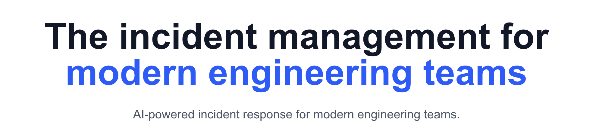
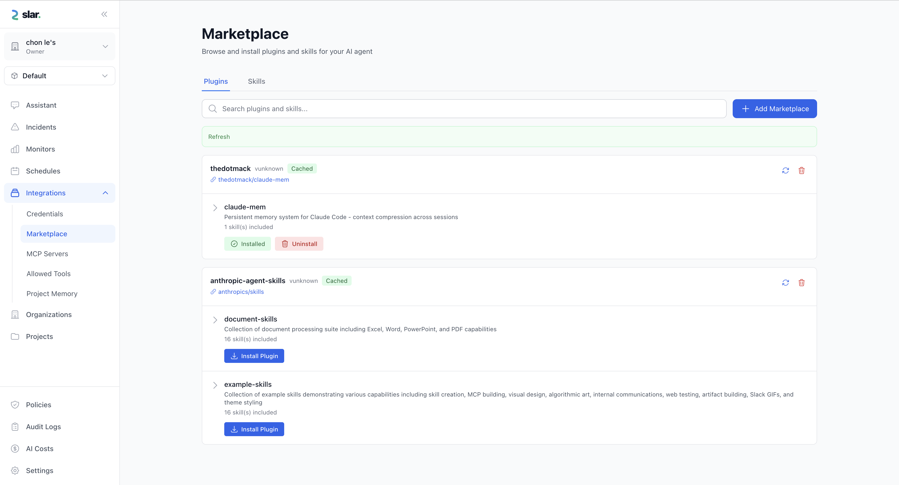

<p align="center">
  
</p>

<h1 align="center">SLAR - Smart Live Alert & Response</h1>

<p align="center">
  <strong>Open-source on-call management with AI-powered incident response</strong>
</p>

---

### What is SLAR?

SLAR is an open-source on-call management platform with AI-powered incident response. It helps teams manage on-call rotations, route alerts, and respond to incidents with AI-powered assistance.

<p align="center">
 
</p>

---

### Configuration via Config File

For more granular control, especially in production or when managing multiple services, you can use a `config.yaml` file instead of (or alongside) environment variables.

---

### Docker Compose (Local / Staging)

The easiest way to get started. Migrations are applied automatically.

#### Step 1: Clone and Configure

```bash
# Get the code
git clone https://github.com/slarops/slar.git

# Make your new project directory
mkdir slar-project

# Tree should look like this
# .
# ├── slar
# └── slar-project

# Copy the compose files over to your project
cp -r slar/deploy/docker slar-project/

# Copy config
cp slar-project/docker/volumes/config/cfg.ex.yaml slar-project/docker/volumes/config/dev.config.yaml

# Switch to your project directory
cd slar-project/docker
docker compose up -d
```

**Access Points:**
*   **console**: http://localhost:8080

---

### 3. Kubernetes (Production)

We provide a specialized Helm chart for production deployments.

#### Step 1: Create Secrets

Avoid putting sensitive data in `values.yaml`. Use Kubernetes Secrets:

```bash
# Get the code
git clone https://github.com/slarops/slar.git

# Make your new project directory
mkdir slar-project

# Tree should look like this
# .
# ├── slar
# └── slar-project

# Copy the compose files over to your project
cp -r slar/deploy/helm slar-project/

# Copy config
cp slar-project/helm/slar/cfg.ex.yaml slar-project/helm/slar/dev.config.yaml

# Switch to your project directory
cd slar-project/helm/slar
helm install slar . -f values.yaml
```

For advanced configuration (Ingress, Persistent Storage, Resources), see [helm](deploy/helm/slar/README.md).

---

## Roadmap

We are constantly working to make SLAR the most powerful and intuitive on-call management platform. Here's what we've built and where we're headed.

### Core On-Call Management
- [x] **Groups & Teams**: Organize your responders into logical units.
- [x] **Flexible Scheduler**: Visual on-call rotation management with override support.
- [x] **Escalation Policies**: Define multi-stage escalation rules for critical incidents.
- [ ] **Advanced Routing**: Route alerts based on service, severity, or custom tags.

### Integrations & Notifications
- [x] **Datasources**: Native support for **Datadog** and **Prometheus**.
- [x] **Slack Notification**: Get alerts and interact with incidents directly from Slack.
- [x] **Webhooks**: Generic webhook support for any third-party tool.

### AI-Powered Incident Response
- [x] **AI Chat (Chat with Infra)**: Context-aware AI that understands your infrastructure.
- [x] **Real-time Incident Resolution**: AI-guided troubleshooting and automated suggestions.
- [x] **Approval Workflows**: Ensure AI-driven actions are approved by human operators.
- [x] **Zero-Trust Security (E2EE)**: End-to-end encryption for sensitive AI conversations.
- [x] **AI Pilot**: Let the AI handle routine remediation steps autonomously.
- [x] **Automated Root Cause Analysis**: Instant post-mortems and analysis when an incident occurs.

### Mobile Experience
- [ ] **Mobile App** (Coming Soon): Manage on-call, acknowledge alerts, and chat with AI on the go.

---

## License

AGPLv3 License - see [LICENSE](LICENSE) for details.
