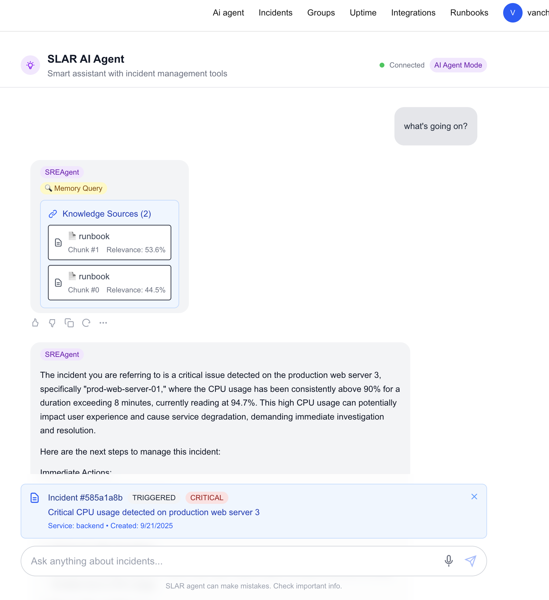

<p align="center">

</p>

# SLAR - Smart Live Alert & Response

Enterprise-grade on-call management platform with AI-powered incident response and intelligent alerting.

<p align="center">

</p>

## Features

- **Schedule Management** - Flexible on-call rotations with automated handoffs
- **Smart Alerting** - AI-driven escalation and intelligent notification routing
- **Team Management** - Multi-team support with role-based access control
- **Timeline Visualization** - Interactive schedule views with real-time updates
- **Slack Integration** - Native notifications and incident management workflows
- **AI Runbook System** - Automated runbook retrieval and incident response guidance
- **Secure Authentication** - Enterprise SSO via Supabase with RLS policies

## Architecture

```
├── api/                    # Go backend + Python AI services
│   ├── cmd/server/        # Main API server
│   ├── handlers/          # HTTP request handlers
│   ├── services/          # Business logic layer
│   ├── workers/           # Background workers (Slack, notifications)
│   └── ai/                # AI agents (AutoGen, runbook retrieval)
├── web/slar/              # Next.js frontend application
│   ├── src/components/    # React UI components
│   ├── src/services/      # API client services
│   └── src/lib/           # Utilities and configurations
└── docs/                  # Documentation
```

## Tech Stack

**Backend**: Go, Gin, PostgreSQL, Redis, Supabase
**Frontend**: Next.js 15, React 19, Tailwind CSS 4, Headless UI
**AI/ML**: Python, AutoGen, OpenAI GPT-4, ChromaDB
**Integrations**: Slack SDK, GitHub API, Vis.js Timeline

## Quick Start

### Prerequisites
- Go 1.24+, Node.js 18+, Python 3.9+
- PostgreSQL 14+ with PGMQ extension
- Redis 6+, Supabase account

### Setup

```bash
# 1. Clone repository
git clone https://github.com/vanchonlee/slar.git
cd slar

# 2. Backend setup
cd api
go mod download
cp supabase_config.example .env  # Configure with your values
go run cmd/server/main.go

# 3. Frontend setup
cd web/slar
npm install
cp supabase-config.example .env.local  # Configure with your values
npm run dev

# 4. AI services (optional)
cd api/ai
pip install -r requirements.txt
python main.py

# 5. Slack worker (optional)
cd api/workers
pip install -r requirements.txt
cp config.example .env  # Configure Slack credentials
python slack_worker.py
```

## Configuration

### Supabase Setup

1. **Create Project**: Visit [supabase.com](https://supabase.com), create new project
2. **Configure Auth**: Enable email authentication, set Site URL to `http://localhost:3000`
3. **Get Credentials**: Copy Project URL and API keys from Settings > API
4. **Update Environment**:

```bash
# Backend (.env)
SUPABASE_URL=https://your-project-ref.supabase.co
SUPABASE_ANON_KEY=your-anon-key-here
SUPABASE_JWT_SECRET=your-jwt-secret-here

# Frontend (.env.local)
NEXT_PUBLIC_SUPABASE_URL=https://your-project-ref.supabase.co
NEXT_PUBLIC_SUPABASE_ANON_KEY=your-anon-key-here
```

### Additional Setup

**Database**: Enable PGMQ extension: `CREATE EXTENSION IF NOT EXISTS pgmq;`

**Slack Integration**: Create Slack app, enable Socket Mode, add scopes: `chat:write`, `channels:read`, `users:read`

## Usage

### Schedule Management
1. Create rotations with flexible shift patterns (daily/weekly/monthly)
2. Assign team members and configure handoff times
3. View interactive timeline with real-time updates

### Incident Response
1. Incidents auto-created from monitoring alerts
2. AI-powered escalation based on severity and context
3. Slack notifications to on-call engineers
4. Automated runbook retrieval for faster resolution

### AI Runbook System
1. Index GitHub repositories containing runbooks
2. Automatic document chunking and vector embedding
3. Intelligent retrieval based on incident context
4. One-click reindexing of all sources

## Development

```bash
# Hot reload development
go install github.com/cosmtrek/air@latest
air                    # Backend hot reload
npm run dev           # Frontend hot reload

# Testing
go test ./...         # Backend tests
npm test             # Frontend tests
```

## API Endpoints

- **Authentication**: `/auth/*` - User management
- **Schedules**: `/api/schedules/*` - Schedule operations
- **Incidents**: `/api/incidents/*` - Incident management
- **Runbooks**: `/runbook/*` - AI runbook system
- **Teams**: `/api/teams/*` - Team management

Documentation available at `/docs` when server is running.

## Contributing

1. Fork repository and create feature branch
2. Follow Go conventions (backend) and ESLint/Prettier (frontend)
3. Write tests for new features
4. Submit pull request with clear description

## License

MIT License - see [LICENSE](LICENSE) file for details.

## Support

- **Issues**: [GitHub Issues](https://github.com/vanchonlee/slar/issues)
- **Documentation**: [Project Wiki](https://github.com/vanchonlee/slar/wiki)

---

**Enterprise-grade on-call management with AI-powered incident response**