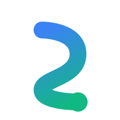
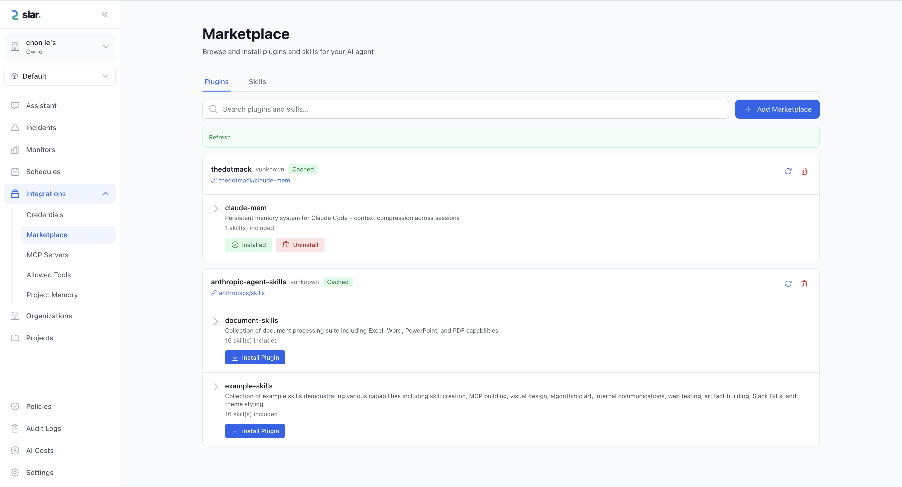

<p align="center">
  
</p>

<h1 align="center">SLAR</h1>

<p align="center">
  <strong>The open-source AI on-call platform that resolves incidents, not just pages you about them</strong>
</p>

<p align="center">
  <a href="https://github.com/SlarOps/slar/stargazers"></a>
  <a href="https://github.com/SlarOps/slar/blob/main/LICENSE"></a>
  <a href="https://github.com/SlarOps/slar/actions/workflows/lint.yml"></a>
  <a href="https://github.com/SlarOps/slar/actions/workflows/build.yaml"></a>
  <a href="https://github.com/SlarOps/slar/actions/workflows/github-code-scanning/codeql"></a>
</p>

<p align="center">
  <a href="#-quick-start">Quick Start</a> •
  <a href="#-why-slar">Why SLAR</a> •
  <a href="#-features">Features</a> •
  <a href="#-architecture">Architecture</a> •
  <a href="#%EF%B8%8F-roadmap">Roadmap</a>
</p>

<p align="center">
  
</p>

---

## The Problem with On-Call Today

It's 3 AM. An alert fires. Your engineer wakes up, spends 45 minutes digging through dashboards, runbooks, and logs — only to find it was a cache miss that needed a single command to fix.

**SLAR changes this.** Your AI agent is already awake, already investigating, already has a remediation plan waiting for your approval.

---

## Why SLAR?

| Traditional On-Call | With SLAR |
|---------------------|-----------|
| Alert fires → Engineer wakes up → Investigate → Fix | AI investigates while you sleep, wakes you only if needed |
| Manually correlate logs, metrics, traces | AI Chat understands your entire infrastructure context |
| Write post-mortem hours after the incident | Automated RCA generated in real-time as it happens |
| Hope the on-call engineer has the right runbook | AI-guided troubleshooting with human-in-the-loop approval |
| PagerDuty/OpsGenie costs $20-40/user/month | Self-hosted, $0/user, full control |

---

## Features

### AI-Powered Incident Response

- **AI Pilot** — Autonomous Claude-powered agent that investigates alerts, suggests fixes, and executes remediations with your approval
- **Real-time AI Chat** — WebSocket-based chat with your infrastructure. Ask "why is payment service slow?" and get answers
- **MCP Tools** — Extend AI capabilities with [Model Context Protocol](https://modelcontextprotocol.io) servers. Connect Kubernetes, databases, cloud APIs — anything
- **Tool Approval** — Human-in-the-loop security. AI proposes actions, you approve before execution
- **Multi-Agent Architecture** — Route different projects to specialized AI agents. Critical services get dedicated agents; others share a default
- **Automated RCA** — Root cause analysis generated automatically as incidents unfold

### On-Call Management

- **Smart Schedules** — Visual rotation builder with overrides, holidays, and timezone support
- **Escalation Policies** — Multi-stage escalation with configurable timeouts
- **Incident Lifecycle** — Trigger, acknowledge, resolve — full PagerDuty-compatible workflow
- **Teams & Groups** — Organize responders with relationship-based access control (ReBAC)

### Integrations

- **Alertmanager / Prometheus** — Native webhook receiver
- **Datadog** — Webhook integration for all Datadog monitors
- **Slack** — Bidirectional: receive alerts, take actions from Slack
- **Generic Webhooks** — Works with any tool that can send HTTP

### Security & Enterprise

- **OIDC Authentication** — Works with Zitadel, Keycloak, Auth0, Okta, Google, Azure AD
- **Zero-Trust AI Channel** — End-to-end encrypted channel between mobile and AI agent
- **Multi-tenant** — Full org and project isolation with ReBAC
- **Audit Logs** — Every AI action and tool execution is logged
- **Credential Vault** — Per-project credential management for AI agents

### Infrastructure

- **Edge Monitoring** — Global uptime checks via Cloudflare Workers
- **Mobile App** — iOS/Android with push notifications and QR-code device pairing
- **Self-hosted** — Docker Compose for local, Helm chart for Kubernetes
- **Open Source** — AGPLv3, no vendor lock-in

---

## Architecture

```
┌─────────────────────────────────────────────────────┐
│                    Clients                          │
│           Web (Next.js)   Mobile App                │
└──────────────┬──────────────────┬───────────────────┘
               │                  │ Zero-Trust (E2E encrypted)
               ▼                  ▼
┌─────────────────────────────────────────────────────┐
│              Control Plane (Go API)                 │
│  • REST API    • WebSocket Proxy   • Agent Registry │
│  • JWT Auth    • Incident Engine   • Alert Routing  │
└──────────────┬──────────────────────────────────────┘
               │ Multi-agent routing
       ┌───────┴────────┐
       ▼                ▼
  ┌─────────┐      ┌─────────┐
  │ AI Agent│      │ AI Agent│   Claude Agent SDK
  │(Project)│      │  (Org)  │   + MCP Servers
  └─────────┘      └─────────┘
       │
  ┌────┴─────────────────────┐
  │     MCP Tool Servers     │
  │  Incidents │ Memory │ …  │
  └──────────────────────────┘
```

**Tech Stack:**
- **API**: Go + Gin — fast, low-overhead control plane
- **AI Agent**: Python + FastAPI + [Claude Agent SDK](https://docs.anthropic.com/en/docs/agents) (Anthropic)
- **Frontend**: Next.js 15 + React 19
- **Database**: PostgreSQL + PGMQ (async queue, no Redis required)
- **Auth**: OIDC-native, bring your own provider

---

## Quick Start

Get SLAR running locally in ~5 minutes with built-in Zitadel authentication.

### 1. Clone and Start

```bash
git clone https://github.com/slarops/slar.git
cd slar/deploy/docker

cp volumes/config/cfg.ex.yaml volumes/config/dev.config.yaml

docker compose up -d
```

Wait ~2 minutes, then check:
```bash
docker compose ps
```

### 2. Create OIDC App in Zitadel

1. Open **http://localhost:8080/ui/console**
2. Login: `zitadel-admin@zitadel.localhost` / `Password1!`
3. Create Project → **New Application**
   - Type: **Web**, Auth Method: **PKCE**
   - Redirect URI: `http://localhost:3001/api/auth/callback/oidc`
   - Post Logout URI: `http://localhost:3001/login`
4. Copy the **Client ID**

### 3. Configure

Create `deploy/docker/.env`:

```bash
OIDC_ISSUER=http://localhost:8080
OIDC_CLIENT_ID=<your-client-id>
NEXTAUTH_URL=http://localhost:3001
NEXTAUTH_SECRET=$(openssl rand -base64 32)

# For AI features:
ANTHROPIC_API_KEY=sk-ant-...
```

### 4. Start

```bash
docker compose up -d web --force-recreate
```

Open **http://localhost:3001** → Sign in with SSO → Done.

| Service | URL | Description |
|---------|-----|-------------|
| Web | http://localhost:3001 | Frontend |
| API | http://localhost:8081 | Go API |
| AI Agent | http://localhost:8002 | Claude Agent |
| Gateway | http://localhost:8000 | Kong |

---

## Bring Your Own OIDC Provider

No lock-in to any auth provider:

| Provider | `OIDC_ISSUER` |
|----------|---------------|
| Zitadel (bundled) | `http://localhost:8080` |
| Keycloak | `https://keycloak.example.com/realms/master` |
| Auth0 | `https://your-tenant.auth0.com` |
| Okta | `https://your-org.okta.com` |
| Google | `https://accounts.google.com` |
| Azure AD | `https://login.microsoftonline.com/{tenant}/v2.0` |

---

## Kubernetes / Production

```bash
cp -r deploy/helm/slar your-infra/
cp your-infra/slar/cfg.ex.yaml your-infra/slar/config.yaml
# edit config.yaml

helm install slar your-infra/slar -f your-infra/slar/values.yaml
```

See [Helm README](deploy/helm/slar/README.md) for Ingress, TLS, resource tuning.

---

## Roadmap

### On-Call Management
- [x] Visual on-call scheduler with rotation overrides
- [x] Multi-stage escalation policies
- [x] Incident lifecycle (trigger → acknowledge → resolve)
- [x] Teams, groups, and ReBAC access control
- [ ] PagerDuty / OpsGenie migration import

### AI & Automation
- [x] Claude-powered AI Chat (real-time WebSocket)
- [x] MCP tool servers (extensible AI capabilities)
- [x] Human-in-the-loop tool approval
- [x] Autonomous AI Pilot for incident remediation
- [x] Multi-agent routing (project-specific + org-level)
- [x] AI cost tracking and analytics
- [ ] Runbook execution via AI
- [ ] AI learns from past incidents (knowledge base)
- [ ] AI Chat on Mobile

### Integrations
- [x] Alertmanager / Prometheus
- [x] Datadog
- [x] Slack (bidirectional)
- [x] Generic webhooks
- [ ] PagerDuty compatible webhook receiver

### Security & Enterprise
- [x] OIDC (Zitadel, Keycloak, Auth0, Okta, Google, Azure AD)
- [x] Zero-Trust AI channel (E2E encrypted)
- [x] Audit logs
- [x] Per-project credential vault
- [ ] SAML SSO

### Monitoring
- [x] Edge monitoring via Cloudflare Workers
- [x] HTTP/HTTPS uptime checks
- [x] Status dashboard
- [ ] Public status page

---

## Contributing

We welcome contributions! SLAR is built by engineers who got tired of paying for PagerDuty.

```bash
# Backend (Go)
cd api && air          # hot reload

# AI Agent (Python)
cd api/ai && python claude_agent_api_v1.py

# Frontend (Next.js)
cd web/slar && npm run dev
```

See [CLAUDE.md](CLAUDE.md) for architecture details and development guide.

---

## Self-Hosted vs. Cloud

SLAR is designed to run **on your infrastructure**:

- Your data never leaves your environment
- No per-seat pricing — scale to 1000 engineers for free
- Customize AI prompts, tools, and workflows
- Integrate with internal systems AI agents can't access from the cloud

---

## License

AGPLv3 — see [LICENSE](LICENSE). Self-host freely. Modifications to the source must be open-sourced under the same license.

---

<p align="center">
  <strong>If SLAR saves your team from a 3 AM incident, consider giving it a star.</strong>
  <br>
  <a href="https://github.com/SlarOps/slar/stargazers">⭐ Star on GitHub</a>
</p>
