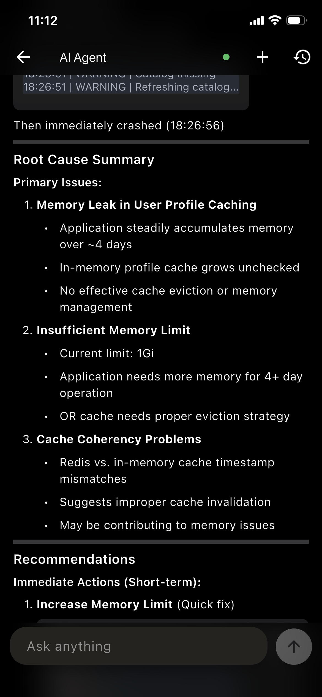

<p align="center">
  
</p>

<h1 align="center">SLAR - Smart Live Alert & Response</h1>

<p align="center">
  <strong>AI-powered incident analysis — understand issues faster, resolve smarter</strong>
</p>

<p align="center">
  <a href="#quick-start">Quick Start</a> •
  <a href="#why-slar">Why SLAR</a> •
  <a href="#features">Features</a> •
  <a href="#roadmap">Roadmap</a>
</p>

---

### Why SLAR?

Most on-call tools just **notify** you. SLAR **resolves** incidents.

| Traditional On-Call | With SLAR |
|---------------------|-----------|
| Alert fires → You wake up → Investigate → Fix | **AI Pilot** investigates & remediates while you sleep |
| Manually write post-mortem after incident | **Automated RCA** generates root cause analysis in real-time |
| Search through runbooks and dashboards | **Chat with your infrastructure** - AI understands your context |
| Hope the on-call engineer knows what to do | **AI-guided troubleshooting** with approval workflows |

### Key Differentiators

- **AI Pilot** - Autonomous remediation for routine incidents
- **Automated RCA** - Instant root cause analysis when incidents occur
- **Chat with Infra** - Context-aware AI that understands your stack
- **Zero-Trust Security** - End-to-end encryption for all AI conversations
- **Human-in-the-Loop** - Approval workflows ensure AI actions are verified
- **Open Source** - Self-host, customize, no vendor lock-in (AGPLv3)

---
[](https://github.com/SlarOps/slar/actions/workflows/lint.yml)
[](https://github.com/SlarOps/slar/actions/workflows/github-code-scanning/codeql)
[](https://github.com/SlarOps/slar/actions/workflows/build.yaml)

### What is SLAR?

SLAR is an open-source, AI-native on-call management platform. It combines traditional on-call features (rotations, escalations, integrations) with AI-powered incident response that can investigate, diagnose, and remediate issues autonomously.

<p align="center">
 
</p>

---

## Quick Start (5 minutes)

Get SLAR running locally with built-in authentication (Zitadel OIDC).

### Step 1: Clone and Start

```bash
# Clone the repository
git clone https://github.com/slarops/slar.git
cd slar/deploy/docker

# Copy example config
cp volumes/config/cfg.ex.yaml volumes/config/dev.config.yaml

# Start all services (includes Zitadel for authentication)
docker compose up -d
```

Wait ~2 minutes for all services to initialize. Check status:
```bash
docker compose ps
```

### Step 2: Create OIDC Application in Zitadel

1. **Open Zitadel Console**: http://localhost:8080/ui/console

2. **Login** with default credentials:
   - Username: `zitadel-admin@zitadel.localhost`
   - Password: `Password1!`

3. **Create a new Project**:
   - Go to **Projects** → **Create New Project**
   - Name: `SLAR`

4. **Create OIDC Application**:
   - Inside the project, click **New Application**
   - Name: `slar-web`
   - Type: **Web**
   - Authentication Method: **PKCE** (recommended) or **Basic**
   - Redirect URIs: `http://localhost:3001/api/auth/callback/oidc`
   - Post Logout URIs: `http://localhost:3001/login`
   - Click **Create**

5. **Copy Client ID** (and Client Secret if using Basic auth)

### Step 3: Configure SLAR

Create `.env` file in `deploy/docker/`:

```bash
# OIDC Configuration
OIDC_ISSUER=http://localhost:8080
OIDC_CLIENT_ID=<your-client-id-from-step-2>
OIDC_CLIENT_SECRET=<your-client-secret-if-basic-auth>

# NextAuth
NEXTAUTH_URL=http://localhost:3001
NEXTAUTH_SECRET=your-random-secret-min-32-chars

# Optional: AI features (get key from https://console.anthropic.com)
ANTHROPIC_API_KEY=sk-ant-...
```

Generate a random secret:
```bash
openssl rand -base64 32
```

### Step 4: Restart Web Service

```bash
docker compose up -d web --force-recreate
```

### Step 5: Access SLAR

- **SLAR Web**: http://localhost:3001
- **Zitadel Console**: http://localhost:8080/ui/console
- **API**: http://localhost:8000/api

Click **Sign in with SSO** → You'll be redirected to Zitadel → Login → Redirected back to SLAR!

---

## Using Your Own OIDC Provider

SLAR works with any OIDC-compliant provider:

| Provider | OIDC_ISSUER Example |
|----------|---------------------|
| Zitadel (included) | `http://localhost:8080` |
| Keycloak | `https://keycloak.example.com/realms/master` |
| Auth0 | `https://your-tenant.auth0.com` |
| Okta | `https://your-org.okta.com` |
| Google | `https://accounts.google.com` |
| Azure AD | `https://login.microsoftonline.com/{tenant}/v2.0` |

Just update `OIDC_ISSUER` and `OIDC_CLIENT_ID` in your `.env` file.

---

## Configuration via Config File

For production deployments, use `config.yaml` instead of environment variables:

```yaml
# volumes/config/dev.config.yaml
database:
  url: "postgres://postgres:postgres@db:5432/slar?sslmode=disable"

oidc:
  issuer: "https://auth.example.com"
  client_id: "your-client-id"
  client_secret: "your-client-secret"

ai:
  anthropic_api_key: "sk-ant-..."
```

---

## Docker Compose Services

| Service | Port | Description |
|---------|------|-------------|
| `web` | 3001 | Next.js frontend |
| `api` | 8081 | Go API server |
| `ai` | 8002 | AI Agent (Claude) |
| `kong` | 8000 | API Gateway |
| `zitadel` | 8080 | OIDC Provider |
| `db` | 5432 | PostgreSQL + PGMQ |

---

## Kubernetes (Production)

We provide a Helm chart for production deployments.

```bash
# Copy helm chart
cp -r deploy/helm/slar your-project/

# Configure values
cp your-project/slar/cfg.ex.yaml your-project/slar/config.yaml

# Install
cd your-project/slar
helm install slar . -f values.yaml
```

For advanced configuration (Ingress, TLS, Resources), see [Helm README](deploy/helm/slar/README.md).

---

## Roadmap

### Core On-Call Management
- [x] **Groups & Teams**: Organize responders into logical units
- [x] **Flexible Scheduler**: Visual on-call rotation with override support
- [x] **Escalation Policies**: Multi-stage escalation rules for critical incidents
- [x] **Services & Routing**: Route alerts to the right team based on service
- [x] **Incident Management**: PagerDuty-style incident lifecycle (trigger, acknowledge, resolve)

### Authentication & Security
- [x] **OIDC Authentication**: Works with any OIDC provider (Zitadel, Keycloak, Auth0, Okta, Google, Azure AD)
- [x] **Multi-tenant**: Organization and project-based access control (ReBAC)
- [x] **Audit Logs**: Track all AI agent actions and tool executions
- [ ] **SAML SSO**: Enterprise SAML support

### Integrations & Notifications
- [x] **Alertmanager/Prometheus**: Native webhook integration
- [x] **Datadog**: Webhook integration for Datadog alerts
- [x] **Slack**: Bidirectional Slack integration (alerts + interactive actions)
- [x] **Webhooks**: Generic webhook support for any third-party tool
- [ ] **PagerDuty Import**: Migrate from PagerDuty
- [ ] **OpsGenie Import**: Migrate from OpsGenie

### AI-Powered Incident Response
- [x] **AI Chat**: Context-aware AI that understands your infrastructure
- [x] **MCP Tools**: Extensible tool system via Model Context Protocol
- [x] **Tool Approval**: Human-in-the-loop approval for sensitive actions
- [x] **AI Pilot**: Autonomous remediation for routine incidents
- [x] **Automated RCA**: Instant root cause analysis when incidents occur
- [x] **Secure Channel**: E2E encryption between Mobile App and AI Agent
- [ ] **Runbook Integration**: AI executes runbooks automatically
- [ ] **Knowledge Base**: AI learns from past incidents

### Uptime Monitoring
- [x] **Edge Monitors**: Cloudflare Workers-based global monitoring
- [x] **HTTP/HTTPS Checks**: URL monitoring with custom headers
- [x] **Status Dashboard**: Real-time uptime visualization
- [ ] **Public Status Page**: Shareable status page for customers

### Mobile Experience
- [x] **Mobile App**: iOS/Android app for on-call management
- [x] **Push Notifications**: FCM-based alert notifications
- [x] **QR Code Pairing**: Secure device pairing via QR code
- [ ] **AI Chat on Mobile**: Chat with AI agent from mobile app

---

## License

AGPLv3 License - see [LICENSE](LICENSE) for details.
